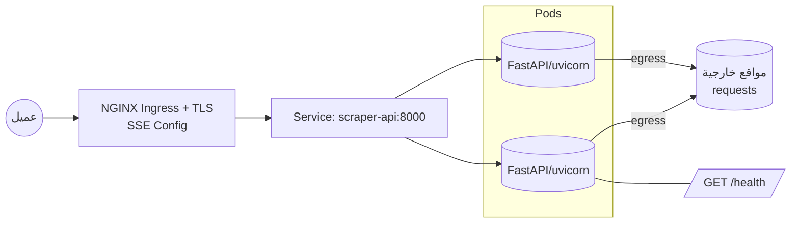

# معمارية الكلاستر لمشروع Canary-DEPI

## نظرة عامة
- خدمة واحدة FastAPI تعمل على `uvicorn` وتقدّم API وواجهة `static`.
- الحاوية تكشف المنفذ `8000` وفق `Dockerfile:12` ويُشغَّل التطبيق على المنفذ نفسه `Dockerfile:15`.
- نقطة الصحة جاهزة على `GET /health` في `main.py:946` لاستخدامها في الـ Probes.
- توجد مسارات للبث الحي SSE: `main.py:602` و`main.py:775` وتتطلب إعدادات Ingress خاصة.

## الرسم المرئي


## مكونات Kubernetes
- Namespace: `canary-depi`.
- Deployment: `scraper-api` بعدد نسخ مبدئي 2–3 مع `readinessProbe` و`livenessProbe` و`resources`.
- Service: `ClusterIP` باسم `scraper-api` على المنفذ `8000`.
- Ingress Controller: خدمة `NodePort` + كائن `Ingress` لقواعد HTTP/HTTPS وإعدادات SSE.
- HPA: يعتمد على متوسط CPU بنسبة 60–70% بنطاق 2–10 نسخ.
- PodDisruptionBudget: `minAvailable: 1` لضمان التوفر أثناء الصيانة.
- NetworkPolicy: السماح inbound من Ingress فقط، والسماح egress للإنترنت للسكرابنج.

## الإتاحة العالية
- تشغيل `Active-Active`: جميع الـ Pods خلف الـ Service.
- الاستجابة للأعطال والضغط عبر: `HPA` + `Readiness/Liveness` + `PDB` + `Topology Spread`.

## التخزين والإضافات
- التطبيق الحالي Stateless ولا يكتب بيانات دائمة.
- عند الحاجة للتخزين:
  - `PVC + PV` داخلي للكلاستر.
  - أو تخزين كائني خارجي (S3/MinIO) أو قاعدة بيانات خارجية (PostgreSQL).
- إضافات موصى بها: `ConfigMap` و`Secret`، `cert-manager`، `metrics-server`، `Prometheus/Grafana`، `Fluent Bit/Loki`.

## تدفق الطلبات
- Client → Ingress (TLS) → Service `scraper-api:8000` → FastAPI Pods → External Websites.
- المسارات: `/`, `/static/*`, `/scrape-pages`, `/scrape-all`, `/scrape-single`, `/scrape-stream`, `/scrape-stream-unlimited`, `/health`.

## إعدادات SSE على Ingress
```yaml
nginx.ingress.kubernetes.io/proxy-read-timeout: "3600"
nginx.ingress.kubernetes.io/proxy-send-timeout: "3600"
nginx.ingress.kubernetes.io/proxy-buffering: "off"
nginx.ingress.kubernetes.io/proxy-http-version: "1.1"
```

## منافذ وتشغيل
```bash
uvicorn main:app --host 0.0.0.0 --port 8000
```

## الرسم الهندسي (Mermaid)


## مراجع من الكود
- الصحة: `main.py:946`.
- التشغيل المحلي: `main.py:957–965`.
- مجلد `static`: `main.py:29–31`.
- `Dockerfile`: الأسطر `12` و`15`.
- نقاط SSE: `main.py:602` و`main.py:775`.

## خدمات Kubernetes المستخدمة
- `ingress-nginx-controller` نوع `NodePort`.
- `Ingress` لإدارة HTTP/HTTPS.
- `scraper-api` نوع `ClusterIP`.
- اختياري: `postgres` نوع `ClusterIP` إذا أضيفت قاعدة بيانات داخلية.
- الإتاحة العالية: `HPA`, `PDB`, `Topology Spread`.

## ملاحظات إضافية
- توصية بموارد الـ Pods: CPU `400–600m`، RAM `512MB–1GB` أو إضافة VPA.
- حماية `NodePort`: قواعد Firewall، IP allow-list، أو Reverse Proxy خارجي.
- تحسين الأمان: LimitRanges، منع privileged، تقييد egress، تشغيل non-root، OPA/Gatekeeper (اختياري).
- الرصد: Dashboard + Prometheus وAlerts على الذاكرة والمعالج وOOMKill والـ Restarts، وتجميع اللوجز بـ Loki/Fluent Bit.
